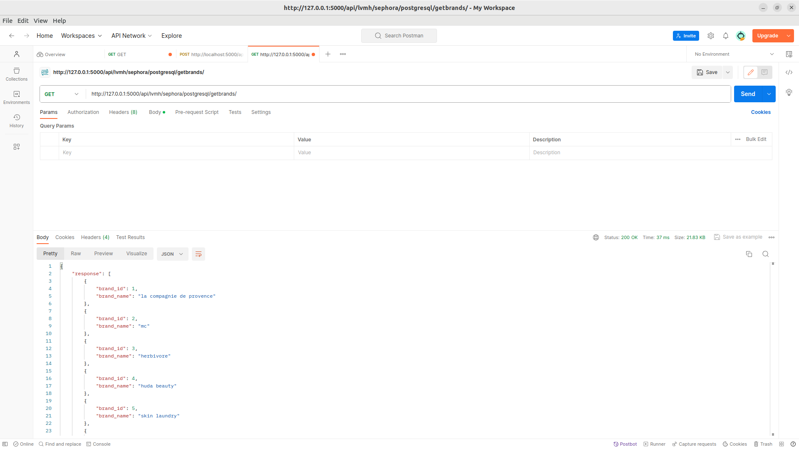
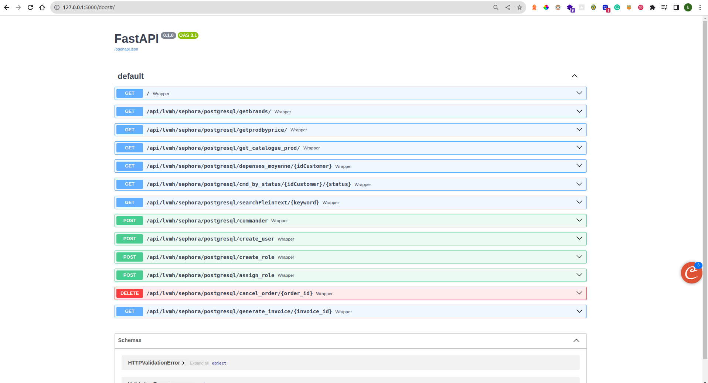

# API LVMH Sephora

L'API LVMH Sephora est une interface de programmation permettant d'interagir avec la base de données de Sephora, une société de produits de beauté et de parfumerie appartenant au groupe LVMH.

**Ici je tiens à souligner que cette base de données est avant tout fictive, car inventée par mes propres soins,
dans le cadre du cours de Base de Données Avancées que je dispense en Master 1 Data Engineer.**

l'objectif de ce cours était triple : 

- Faire du postgreSQL en utilisant des mécanimses d'optimisations de requêtes et aborder la notion des extensions
- Mettre en place une api qui interagit avec cette base de données, dans le but d'emmener les étudiants à appréhender en profondeur la nécessité 
d'une bonne modélisation avec UML dans le respect des normes de l'industrie du génie logiciel
- enfin, de mieux maîtriser les notions de roles, users et privilèges dans la manipulation d'une base de données ainsi que leurs impactes au sein d'une application

Pour notre API, avons utilisé :

- le patron de conception DAO
- le langage python
- 2 exemples de framework comme point d'accès : Flask (dont les routes sort reprises ci-dessous) et Fast (repris dans sa doc automatique)
- une base d données postgreSQL sur supabase
- connecté la bd supabase sur le client pgAdmin
- Et enfin nous avons généré une documentation grace à https://readthedocs.org/

## utilisation

1. Dans le dossier api > `python mainFlask.py` ou `python mainFast.py`

2. Dans les deux cas, l'adresse est :  `http://127.0.0.1:5000` ou `http://10.188.255.1:5000` ou `http://localhost:5000` ou `http://0.0.0.0:5000`

## Fonctionnalités principales pour FlaskAPI

1. **Obtenir la liste des marques :** GET /api/lvmh/sephora/postgresql/getbrands/

2. **Obtenir les produits triés par prix :** GET /api/lvmh/sephora/postgresql/getprodbyprice/

3. **Obtenir le catalogue complet des produits :** GET /api/lvmh/sephora/postgresql/get_catalogue_prod/

4. **Obtenir les dépenses moyennes d'un client :** GET /api/lvmh/sephora/postgresql/depenses_moyenne/<idCustomer>

5. **Obtenir les commandes d'un client par statut :** GET /api/lvmh/sephora/postgresql/cmd_by_status/<idCustomer>/<status>

6. **Rechercher des produits par texte intégral :** GET /api/lvmh/sephora/postgresql/searchPleinText/<keyword>

7. **Passer une commande :** POST /api/lvmh/sephora/postgresql/commander

8. **Créer un nouvel utilisateur :** POST /api/lvmh/sephora/postgresql/create_user

9. **Créer un nouveau rôle :** POST /api/lvmh/sephora/postgresql/create_role

10. **Attribuer des privilèges à un rôle :** POST /api/lvmh/sephora/postgresql/assign_privileges

11. **Attribuer un rôle à un utilisateur :** POST /api/lvmh/sephora/postgresql/assign_role

12. **Annuler une commande :** DELETE /api/lvmh/sephora/postgresql/cancel_order/<order_id>

13. **Générer une facture :** GET /api/lvmh/sephora/postgresql/generate_invoice/<invoice_id>

## Fonctionnalités principales pour FastAPI

fastAPI donne la posisbilité d'accéder à une documentation générée automatiquement à partir de ce lien : 
`http://127.0.0.1:5000/docs`

## Configuration

- L'API utilise le framework Flask et/ou Fast pour la gestion des routes.
- Les logs des requêtes sont enregistrés dans un fichier `logs.json` lorsqu'il s'agit de l'api FLASK.
- La politique de confidentialité est affichée à la racine de l'API.

## Auteur

MULAPI TITA Ketsia (contact@ketsiamulapi.com)

## Licence

Ce projet est sous licence MIT - voir le fichier `LICENSE` pour plus de détails.
